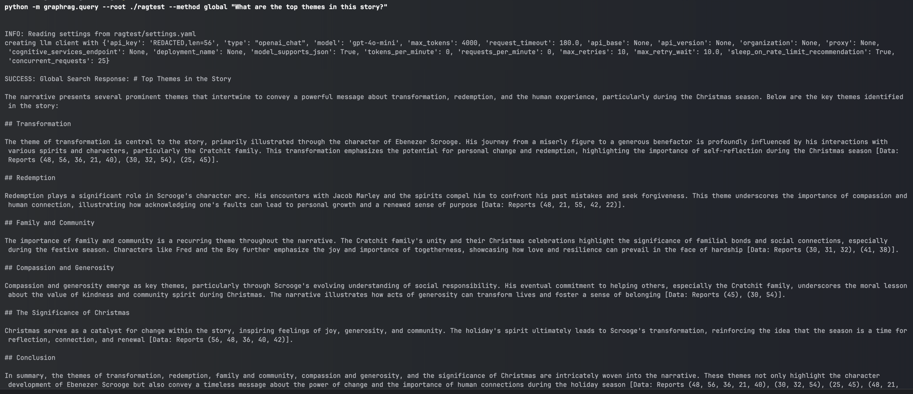

# ragKnowledge

[中文版本](#ragknowledge-中文版)

ragKnowledge is a demonstration project showcasing the capabilities of GraphRAG (Graph-based Retrieval-Augmented Generation). This tool processes text data using a graph-based approach, allowing for intelligent querying and analysis of the input content.

## Features

- Create knowledge graphs from text input
- Perform global and local queries on processed data
- Demonstrate the power of graph-based RAG techniques
- Easy to set up and use


## Prerequisites

- Python 3.x
- pip (Python package installer)

## Installation

1. Clone the repository:
   ```
   git clone https://github.com/sydowma/ragKnowledge.git
   cd ragKnowledge
   ```

2. Install the required dependencies:
   ```
   pip install -r requirements.txt
   ```

3. Set up your environment:
   - Create a `.env` file in the project root and add your OpenAI API key:
     ```
     OPENAI_API_KEY=your_api_key_here
     ```
   - Update the `settings.yaml` file with your preferred model settings.

## Usage

### Preparing the Environment

Create the necessary directories:

```shell
mkdir -p ./ragtest/input
```

### Preparing Data

Download a sample text file:

```shell
curl https://www.gutenberg.org/cache/epub/24022/pg24022.txt > ./ragtest/input/book.txt
```

### Initializing the Index

```shell
python -m graphrag.index --init --root ./ragtest
```

### Creating the Graph RAG

```shell
python -m graphrag.index --root ./ragtest
```

### Executing Queries

To perform a global query:

```shell
python -m graphrag.query --root ./ragtest --method global "What are the top themes in this story?"
```

## Example Outputs

(Here you can add some example queries and their outputs to showcase the capabilities of ragKnowledge)

## Contributing

Contributions are welcome! Please feel free to submit a Pull Request.


Project Link: [https://github.com/sydowma/ragKnowledge](https://github.com/sydowma/ragKnowledge)

---

# ragKnowledge (中文版)

ragKnowledge 是一个演示项目,展示了 GraphRAG（基于图的检索增强生成）的功能。该工具使用基于图的方法处理文本数据,允许对输入内容进行智能查询和分析。

## 功能特点

- 从文本输入创建知识图谱
- 对处理后的数据执行全局和局部查询
- 展示基于图的RAG技术的强大功能
- 易于设置和使用

## 前提条件

- Python 3.x
- pip (Python包安装器)

## 安装

1. 克隆仓库:
   ```
   git clone https://github.com/sydowma/ragKnowledge.git
   cd ragKnowledge
   ```

2. 安装所需依赖:
   ```
   pip install -r requirements.txt
   ```

3. 设置环境:
   - 在项目根目录创建一个 `.env` 文件,并添加你的OpenAI API密钥:
     ```
     OPENAI_API_KEY=你的api密钥
     ```
   - 更新 `settings.yaml` 文件,设置你偏好的模型参数。

## 使用方法

### 准备环境

创建必要的目录:

```shell
mkdir -p ./ragtest/input
```

### 准备数据

下载示例文本文件:

```shell
curl https://www.gutenberg.org/cache/epub/24022/pg24022.txt > ./ragtest/input/book.txt
```

### 初始化索引

```shell
python -m graphrag.index --init --root ./ragtest
```

### 创建图形RAG

```shell
python -m graphrag.index --root ./ragtest
```

### 执行查询

执行全局查询:

```shell
python -m graphrag.query --root ./ragtest --method global "这个故事的主要主题是什么?"
```

## 输出示例

(在此处你可以添加一些查询示例及其输出,以展示ragKnowledge的功能)

## 贡献

欢迎贡献!请随时提交Pull Request。

项目链接: [https://github.com/sydowma/ragKnowledge](https://github.com/sydowma/ragKnowledge)